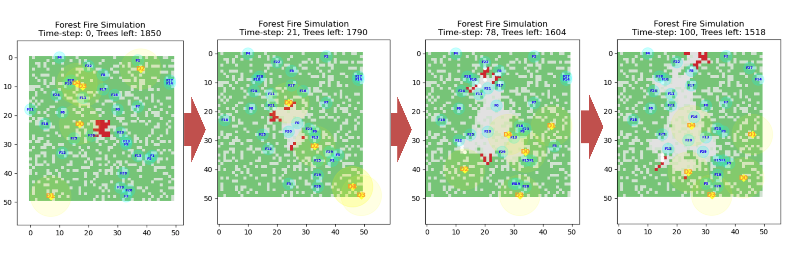

# A Multi-Agent System for Dynamic Firefighting Coordination

<div align="center">


  
| 🧯 Completion Rate | 👥 Avg. Team Size | 🌲 Avg. Cluster Size | ⏱️ Avg Extinguish Time |
|-------------------|------------------|----------------------|------------------------|
| **89.5%**         | **1.17**         | **1.72**             | **8.23 steps**         |

| 🕰️ Most Idle Firefighter | 🚫 Collisions Detected | 🚀 Peak System Throughput |
|--------------------------|------------------------|----------------------------|
| **F2 (10 steps)**        | **2 (worst case)**     | **5 fires/timestep**       |

</div>

---

## 🌍 Overview

This simulation models a forest environment with intelligent, decentralized agents working to detect and extinguish wildfires. It includes two types of agents:

- **🚒 Firefighters:** Ground-based agents with limited range and water supply.  
- **🚁 Drones:** Aerial scouts that detect fires, cluster hotspots, and coordinate task allocation using the **Contract-Net Protocol (CNP)**.

The simulation runs on a grid-based environment using `agentpy`, and tracks dynamic interactions including perception, bidding, movement, collision, and fire suppression—all in real-time.

> A high-fidelity simulation of decentralized firefighting using the Contract-Net Protocol (CNP). Agents dynamically coordinate in real time to detect, bid for, and extinguish fires across a forest environment.

## 🧠 Architecture: Contract-Net Protocol (CNP)

This simulation implements the Contract-Net Protocol (CNP) as the core coordination mechanism between heterogeneous agents operating in a partially observable, dynamic environment. The roles are clearly partitioned between **drones** (task managers) and **firefighters** (task executors), simulating a distributed negotiation framework that operates under real-time constraints.

The CNP implementation in this model departs from theoretical idealizations by adapting to **environmental noise**, **resource limitations**, and **asynchronous task feedback**, all while maintaining decentralized decision-making logic.


### 🎯 Design Rationale

At its core, the CNP is designed to solve the dynamic task allocation problem. In this domain, "tasks" correspond to spatially-distributed fire clusters, and "bidders" are mobile agents with varying resource availability and local constraints. The choice of CNP over other coordination mechanisms (e.g., stigmergy, token passing, or central planning) stems from its ability to:

- Allow **parallel bidding** by distributed agents
- Enable **fine-grained bid evaluation models** (e.g., spatial utility)
- Maintain **modularity** in negotiation phases
- Support **asynchronous assignment and execution**, which is critical given varying travel times and local conditions

### 📐 Modular Protocol Phases

The protocol is decomposed into four explicit phases. Each phase has corresponding data structures, JSON communication messages, and logging logic to support full traceability and post-hoc analysis.

### 🔁 The CNP Negotiation Loop

```
╭──────────────────────────── Forest Grid ─────────────────────────────╮
│                                                                      │
│   🔁 Drones Patrol        🔥 Detect Fire at (x,y)                     │
│       │                        │                                     │
│       ▼                        ▼                                     │
│   BFS-based Clustering   →   Cluster C = { (x1,y1), (x2,y2), ... }   │
│       │                        │                                     │
│       ▼                        ▼                                     │
│  Contract Creation:    →    task = {                                 │
│                             "task_id": ...,                          │
│                             "location": centroid(C),                 │
│                             "cluster": C,                            │
│                             "team_size": ⌈|C|/2⌉,                    │
│                             "status": "open",                        │
│                             ...                                      │
│                           }                                          │
│       │                        │                                     │
│       ▼                        ▼                                     │
│  Append to global contract pool (fire_contracts)                     │
│                                                                      │
╰──────────────────────────────────────────────────────────────────────╯
```

### 📨 Contract Message Structure (JSON-based)

```json
{
  "task_id": "fire_42_18_76",
  "location": [42, 18],
  "cluster": [[42,18],[42,19],[43,18]],
  "type": "extinguish_fire",
  "timestamp": 76,
  "status": "open",
  "team_size": 2,
  "bids": [],
  "assigned": [],
  "assign_time": null,
  "manager": "drone_3"
}
```

### 🧮 Bid Evaluation Model (Firefighter Logic)

```
    bid_value = distance_to_fire / (water_supply + ε)
```

This approach naturally prioritizes agents that are both **closer** to the fire and **better equipped**, without requiring global optimization. All bids are appended to the contract object and logged.


### 🤝 Assignment Protocol (Drone Logic)

```json
{
  "event": "assignment",
  "task_id": "fire_42_18_76",
  "assigned_to": ["F3", "F5"],
  "drone_id": "drone_3",
  "time": 77
}
```

### 🚒 Execution and Feedback Loop

```json
{
  "event": "complete",
  "task_id": "fire_42_18_76",
  "firefighter_id": "F5",
  "time": 84
}
```

### 🧪 Logs and Metrics for Evaluation

- `contract_logs` → creation, bid, assignment, completion
- `firefighter_debug_logs` → perception events
- `drone_debug_logs` → cluster detection events
- `position_logs` → collision detection + movement traces


## 📊 Performance Visualizations

Six performance metrics are computed per run and plotted automatically:

| Metric | Visualized As |
|--------|----------------|
| 🔥 Response Time | Histogram (fire detection ➝ assignment) |
| ⏱️ Extinguish Time | Histogram (detection ➝ fire put out) |
| 💧 Resource Use | Bar plot (team size per fire) |
| 📦 Task Allocation Efficiency | Line plot (assignments over time) |
| 🧍‍♂️ Collision Count | Line plot (collisions per timestep) |
| 📈 System Throughput | Line plot (fires completed per timestep) |

---

## ⚙️ How to Run

Follow these steps to set up and run the project on your local machine:


### 1. Clone the Repository

```bash
git clone https://github.com/LuisPostigo/A_Multi-Agent_System_for_Dynamic_Firefighting_Coordination.git
cd A_Multi-Agent_System_for_Dynamic_Firefighting_Coordination
```


### 2. Create a Virtual Environment (no conda)

```bash
python -m venv MAS_Dynamic_Firefighting_Coordination
```


### 3. Activate the Virtual Environment

- **macOS/Linux:**
  ```bash
  source MAS_Dynamic_Firefighting_Coordination/bin/activate
  ```

- **Windows (CMD):**
  ```cmd
  MAS_Dynamic_Firefighting_Coordination\Scripts\activate.bat
  ```

- **Windows (PowerShell):**
  ```powershell
  .\MAS_Dynamic_Firefighting_Coordination\Scripts\Activate.ps1
  ```


### 4. Install Dependencies

```bash
pip install -r requirements.txt
```


### 5. Run the Model

```bash
python main.py
```


### (Optional) Deactivate the Environment When Done

```bash
deactivate
```
